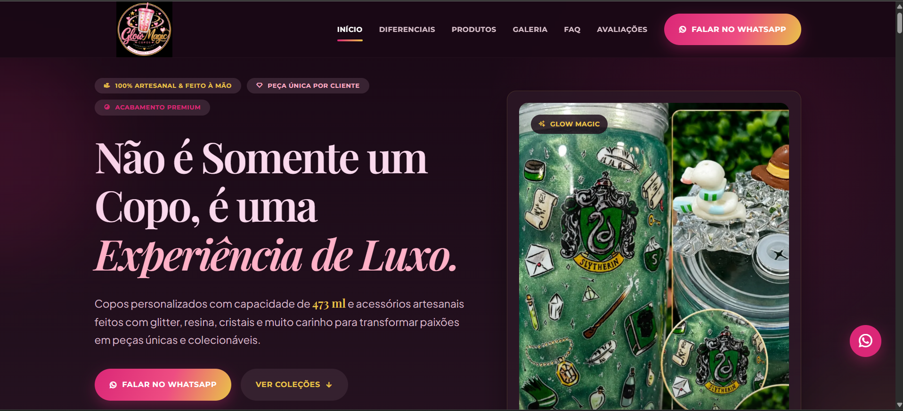

# Glow Magic



Site institucional da Glow Magic para apresentação de copos personalizados,
acessórios artesanais e peças exclusivas feitas à mão.

O projeto é uma página única (one-page) desenvolvida com HTML, CSS e JavaScript
puros, sem framework, bundler ou dependências instaladas localmente.

## Demonstração

- Site publicado: [glowmagic.vercel.app](https://glowmagic.vercel.app/)

## Funcionalidades

- Header fixo com navegação por âncoras.
- Menu responsivo com botão hambúrguer em telas menores.
- Destaque automático da seção ativa durante a rolagem.
- Hero institucional com chamada para contato pelo WhatsApp.
- Seções de essência da marca, diferenciais e processo artesanal.
- Catálogo de produtos com filtros por categoria.
- Links de WhatsApp com mensagens pré-preenchidas para contato geral e produtos específicos.
- Galeria responsiva com lightbox, navegação por setas e teclado.
- Accordions exclusivos para cuidados com a peça e perguntas frequentes.
- Botão flutuante do WhatsApp e botão de retorno ao topo.
- Atualização automática do ano no rodapé.
- Metadados básicos de SEO, favicon, `robots.txt` e `sitemap.xml`.
- Estados de foco para navegação por teclado e suporte a preferência de movimento reduzido.

## Tecnologias

- HTML5 semântico.
- CSS3 com Grid, Flexbox, variáveis CSS e media queries.
- JavaScript moderno, sem bibliotecas de runtime.
- [Remix Icon](https://remixicon.com/) via CDN.
- Google Fonts: Montserrat, Playfair Display e Plus Jakarta Sans.

## Executar localmente

Não é necessário instalar dependências. É possível abrir o arquivo `index.html`
diretamente no navegador, mas um servidor HTTP local é recomendado para testar
o comportamento como em uma hospedagem real.

### Com Python

Na raiz do projeto, execute:

```powershell
python -m http.server 8000
```

Depois, acesse [http://localhost:8000](http://localhost:8000).

### Com Node.js

Caso tenha o Node.js instalado, também pode usar:

```powershell
npx serve .
```

## Estrutura do projeto

```text
glowmagic/
├── index.html                 # Estrutura e conteúdo da página
├── README.md                  # Documentação do projeto
├── robots.txt                 # Regra de rastreamento e referência do sitemap
├── sitemap.xml                # URL principal para mecanismos de busca
└── assets/
	├── css/
	│   └── style.css          # Tema, layout, responsividade e animações
	├── images/                # Logo, produtos, galeria e imagens institucionais
	└── js/
		└── script.js          # Interações e acessibilidade da página
```

## Organização da página

As principais seções estão em `index.html`:

1. Início e apresentação principal.
2. Nossa essência.
3. Diferenciais.
4. Produtos em destaque.
5. Processo de criação.
6. Galeria.
7. Cuidados com a peça.
8. Perguntas frequentes.
9. Contato.

## Onde fazer alterações

### Conteúdo

Edite textos, links, categorias e mensagens dos produtos em `index.html`.
Os links do WhatsApp usam o parâmetro `text` codificado na URL para abrir uma
mensagem inicial já preenchida.

### Aparência

As cores principais, tipografia, espaçamentos, grids e breakpoints estão no
início de `assets/css/style.css`, dentro de `:root` e das seções de layout.

### Comportamento

As interações ficam em `assets/js/script.js`:

- menu mobile;
- navegação ativa;
- botão de retorno ao topo;
- filtros do catálogo;
- accordions;
- lightbox da galeria;
- atualização do ano do rodapé.

### Imagens

Adicione ou substitua arquivos em `assets/images/` e atualize os caminhos e
atributos `alt` correspondentes no HTML.

## Publicação

Como o projeto é estático, pode ser publicado diretamente em serviços como
Vercel, GitHub Pages, Netlify ou qualquer servidor que entregue arquivos HTML,
CSS e JavaScript.

Não há etapa de build nem comando de compilação. O arquivo `index.html` deve
permanecer na raiz da publicação.

## Validação manual

Antes de publicar, verifique:

- menu mobile em telas pequenas;
- filtros de produtos;
- abertura, fechamento e navegação do lightbox;
- accordions de FAQ e cuidados;
- links e mensagens do WhatsApp;
- navegação por teclado e foco visível;
- carregamento das imagens e fontes externas;
- layout em desktop, tablet e celular.

## Autoria

Desenvolvido por [Diego Francisco da Silva](https://diegofranciscodasilva.github.io/dev-software-web/).
